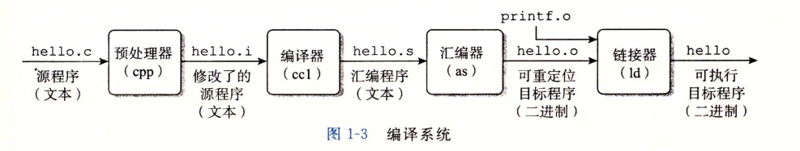
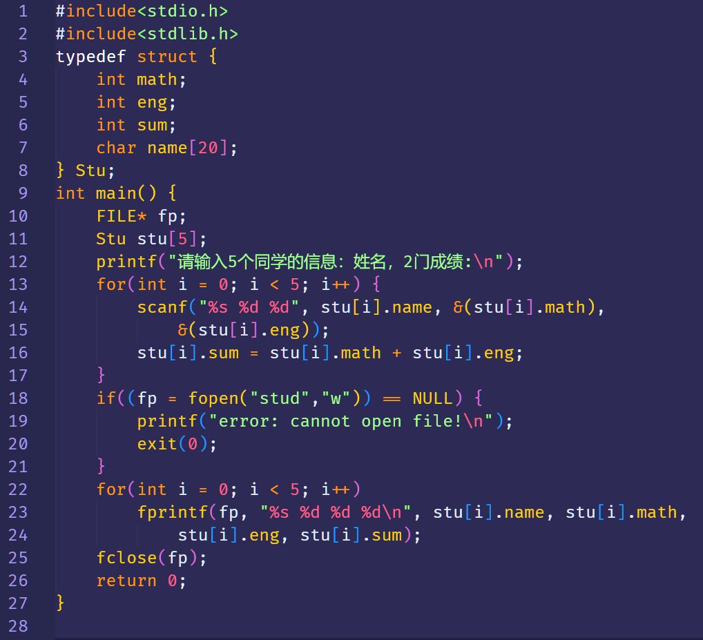
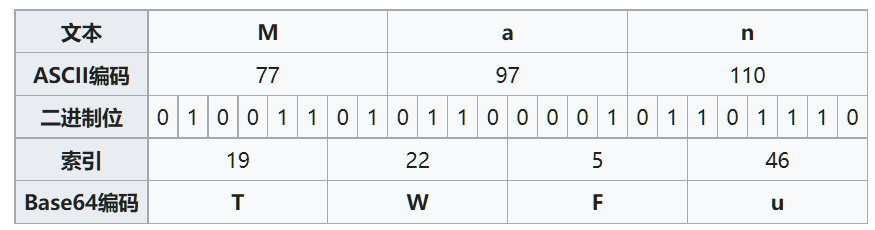
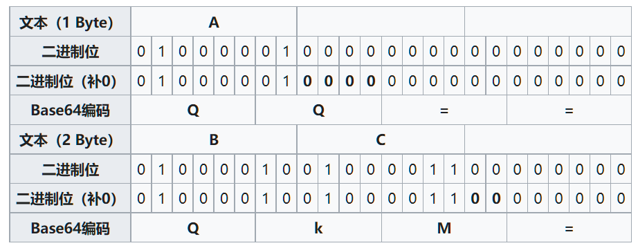
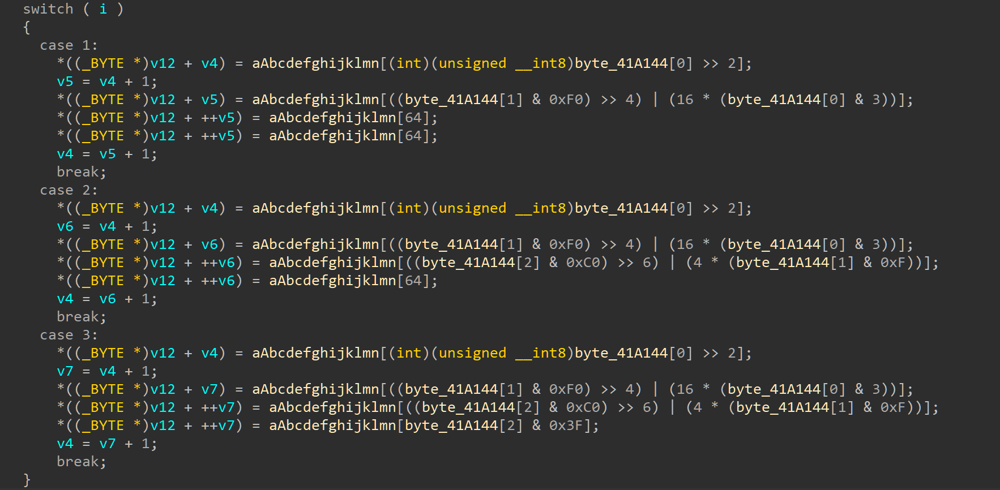
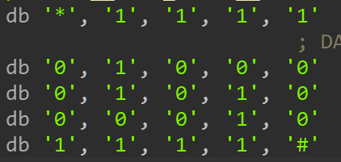
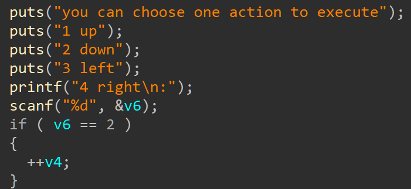

<!--
_class: lead gaia
_paginate: false
_footer: 'Powered by Marp for VS Code'
-->

<style scoped>
  footer {
    text-align: center;
  }
</style>
)

# <!-- fit --> Introduction to RE in CTF

#### s0uthwood@or4nge

---

<!-- 
backgroundColor: white
_header: ''
-->

# 个人介绍


- s0uthwood
- @or4nge (2021.3-)
- Baby REer following DaiDai
- s0uthwood.github.io

---

# 目录

1. 什么是逆向
2. 前置知识
3. 逆向分析技术
4. RE in CTF
   - 静态分析
   - 动态分析
   - 算法识别
5. 保护技术

---

# 什么是逆向

> 逆向工程是根据已有产物和结果，通过分析推导出具体的实现方法



<style scoped>
  h5 {
    text-align: center
  }
</style>

##### 正向：`源代码--->汇编代码--->可执行文件`

##### 逆向：`源代码<---汇编代码<---可执行文件`

---

# 逆向的应用

- 制作软件插件
- 软件破解
- 算法复制
- 漏洞挖掘与修复
- 病毒分析
- ...

---

# 为什么学习逆向

- Want to know how black box works
- 难度最高的方向之一，挑战自己
- 为漏洞挖掘等安全领域打好基础
- Reverse for fun
- ...

---

# 逆向与其他方向的联系

- Misc
- Crypto
- Pwn
- Web

每个方向过程中都可能含有逆向

逆向题中也可能包含其他四个方向的知识

---

# 前置知识


- C/C++
- 库函数很多的语言
  - 如python

后续学习：

- 汇编
- 操作系统
- 各种工具使用
- 等等

---

# RE in CTF

最常见的题型就是要求输入一串字符，程序对输入进行验证

与真实的注册码验证机制类似

---

# 基础知识点

- **静态分析技术**
- 动态调试技术
- **常见算法识别**

除了加密算法识别的基本功，还有：SMC、脱壳、混淆、反调试 $\cdots$

---

# 逆向分析技术——静态分析

> 根据给定程序的架构、语言，进行反汇编（反编译），根据反汇编（反编译）的结果进行分析。

1. 测试运行，了解程序功能
2. 破解保护
3. 查看反汇编或反编译结果理解程序逻辑

- 提供基本认识，方便后续进行动调或其他分析方法
- 安全（程序可能为木马或病毒等）

---

<!--header: 逆向分析技术——静态分析-->

## 工具

<style scoped>
  h3 {
    color: red
  }
</style>

### IDA Pro

最常用，唯一缺点是闭源

###### Ghidra

快捷键不方便，国内教程较少，优点是支持较多架构

###### radare2

学习难度较高，缺少反编译（可以集成retdec进行反编译）

---

## 操作方法

- F5查看反编译
- Shift+F12查看字符串
- n修改变量名、函数名
- y修改变量类型
- 等等


---

## 题目演示

Hello RE

```c
while (1) {
    printf("Input your license\n");
    scanf("%s", s); // 这里也许会溢出，但这不关键
    if (!strcmp(s, "flag{Hello_RE!}")) {
        printf("Congratulations!!!\n");
        break;
    } else {
        printf("Wrong!\n");
    }
}
```

---

<!-- header: '' -->

# 逆向分析技术——动态分析

> 对于较大的程序，静态分析会有分析速度较慢，工程量较大的弊端。因此动态跟踪是必不可少的。

1. 使用调试器
2. 观察内存和寄存器的变化来判断执行逻辑

---

<!-- header: 逆向分析技术——动态分析 -->

## 工具

|          |   EXE  |    ELF     |
|   :---:  |  :---: |   :---:    |
|IDA Pro + | Windbg | remote gdb |
|| x64dbg (ollydbg) |    gdb     |

---

### EXE: IDA Pro

动调选择local debug即可

---

### ELF: IDA Pro + remote gdb

目前使用的有两种VM方案 (WSL2, vmware)

将linux_server文件复制到二进制文件所在目录下

ida选项前两行填写二进制文件名，第三行填写参数（通常为空）

区别为下一行的ip

---

### ELF: IDA Pro + remote gdb

IP填写：

- WSL2下填写 `127.0.0.1` 即可
- vmware使用NAT模式，填写 `192.168.x.x` ip即可
  - 踩到的坑：如果无法连接，需要去网卡选项修改vmware网卡设置，将ip选项更改为手动，设置为 `192.168.x.1`，然后重启网卡

---

## 题目演示

[zer0pts]strcmp

---

<!--header: ''-->

# 常见算法识别

常见的有两类算法：

- 加解密算法
- 数学游戏

主要凭借一些特征来判断

---

<!--header: 常见算法识别-->

# 加解密算法

- Base64
- TEA家族
- RC4

主要特征包括：常数、循环次数、代码结构等等

---

## Base64——编码算法



---



---

[buuoj]reverse3



---

## TEA——分组密码

TEA: 微型加密算法（Tiny Encryption Algorithm）

```c
void encrypt (uint32_t* v, uint32_t* k) {  
    uint32_t v0=v[0], v1=v[1], sum=0, i;
    uint32_t delta=0x9e3779b9;
    uint32_t k0=k[0], k1=k[1], k2=k[2], k3=k[3]; 
    for (i=0; i < 32; i++) {
        sum += delta;  
        v0 += ((v1<<4) + k0) ^ (v1 + sum) ^ ((v1>>5) + k1);
        v1 += ((v0<<4) + k2) ^ (v0 + sum) ^ ((v0>>5) + k3);
    }
    v[0]=v0; v[1]=v1;  
}  
```

---

#### TEA 特征

- delata: 0x9e3779b9 (可能被修改)

```c
uint32_t delta=0x9e3779b9;
```

- 循环次数: 32（可能被修改）
```c
for (int i = 0; i < 32; i++){}
```

- 加密公式: `<< 4`, `>> 5`

```c
((v1<<4) + k0) ^ (v1 + sum) ^ ((v1>>5) + k1);
```

---

### XTEA

```c
void encipher(uint32_t num_rounds, uint32_t v[2], uint32_t const key[4]) {  
    unsigned int i;  
    uint32_t v0=v[0], v1=v[1], sum=0, delta=0x9E3779B9;  
    for (i=0; i < num_rounds; i++) {  
        v0 += (((v1 << 4) ^ (v1 >> 5)) + v1) ^ (sum + key[sum & 3]);  
        sum += delta;  
        v1 += (((v0 << 4) ^ (v0 >> 5)) + v0) ^ (sum + key[(sum>>11) & 3]);  
    }  
    v[0]=v0; v[1]=v1;  
}  
```

---

#### XTEA 特征

- delta: 0x9E3779B9（可能被修改）

```c
uint32_t delta=0x9E3779B9;
```

- 循环次数: 32（可能被修改）

- 加密公式: `<< 4`, `>> 5`, `>> 11`, `& 3`

```c
(((v0 << 4) ^ (v0 >> 5)) + v0) ^ (sum + key[(sum>>11) & 3])
```

---

### XXTEA

```c
#define DELTA 0x9e3779b9
#define MX (((z >> 5 ^ y << 2) + (y >> 3 ^ z << 4)) ^ ((sum ^ y) + (key[(p & 3) ^ e] ^ z)))
  rounds = 6 + 52 / n;
  sum = 0;
  z = v[n-1];
  do {
    sum += DELTA;
    e = (sum >> 2) & 3;
    for (p=0; p<n-1; p++) {
      y = v[p+1];
      v[p] += MX;
      z = v[p];
    }
    y = v[0];
    v[n-1] += MX;
    z = v[n - 1];
  } while (--rounds);
```

---

#### XXTEA 特征

- delta: 0x9e3779b9（可能被修改）

- round: 6 + 52 / n（可能被修改）

- 计算公式: `>> 5`, `<< 2`, `>> 3`, `<< 4`, 双重循环

```c
(((z >> 5 ^ y << 2) + (y >> 3 ^ z << 4)) ^ ((sum ^ y) + (key[(p & 3) ^ e] ^ z)))
```

---

## RC4——流密码

```python
def crypt(data: str, key: bytes) -> str:
    x = 0
    box = list(range(256))   # box = [i for i in range(256)]
    for i in range(256):
        x = (x + int(box[i]) + int(key[i % len(key)])) % 256
        box[i], box[x] = box[x], box[i] ^ 0x37
    x = y = 0
    out = []
    for char in data:
        x = (x + 1) % 256
        y = (y + box[x]) % 256
        box[x], box[y] = box[y], box[x]
        out.append(chr(ord(char) ^ box[(box[x] + box[y]) % 256]))
    return ''.join(out)
```

---

# 数学游戏

- 迷宫
- 数独
- 拼图
- 八皇后
- 矩阵乘法
- ...

---

## 迷宫

[buuoj]不一样的flag





---

<!--header: ""-->

# 保护技术

#### 反静态

- 壳
- 花指令
- SMC

#### 反动态

- 反调试

---

<!--header: ""-->

# 个人建议

1. **学会使用搜索引擎**
2. 对于逆向而言，实践重于理论，刚入门时不要盲目学习汇编等基础知识，即没有提高，又会丧失兴趣
3. 不要拒绝查看别人的 writeup，积极复现，在实践中学习基础知识
4. 关注前沿知识，关注圈内大佬
5. 不要急于追求广度，瓶颈也许意味着突破
6. 比赛不要在意是否报名，也不要和别人 py

> 最好的学习方法是实践和交流分享

---

# References

- 《加密与解密（第四版）》
- 《深入理解计算机系统（第三版）》
